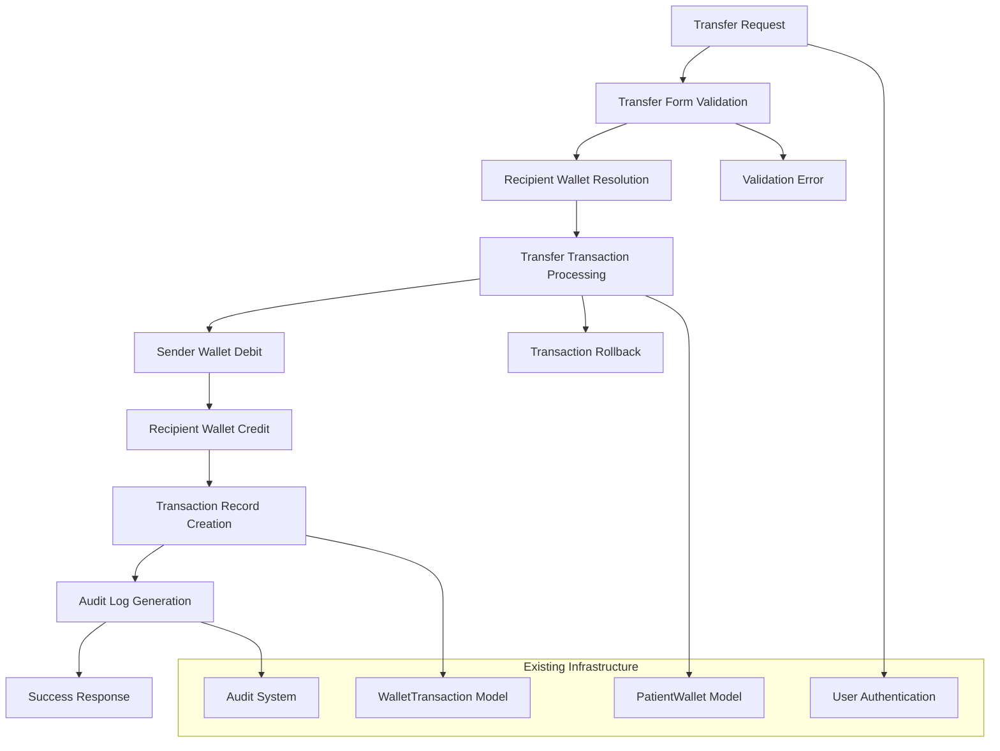
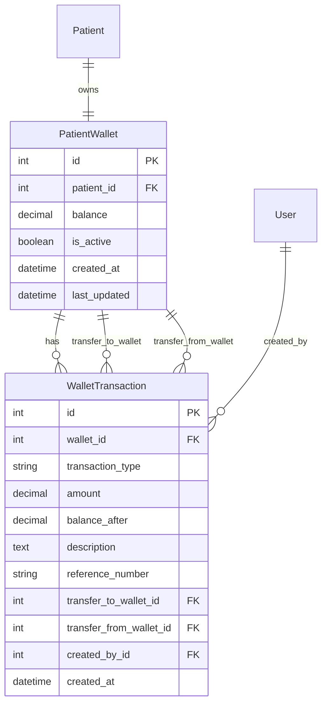

# Design Document

## Overview

The Wallet Fund Transfer feature leverages the existing robust wallet infrastructure in the HMS system to enable secure, auditable transfers between patient wallets. The design builds upon the current PatientWallet and WalletTransaction models, utilizing the existing transaction framework while adding transfer-specific enhancements for improved user experience and audit capabilities.

The system already has a solid foundation with wallet models, transaction tracking, and a comprehensive UI. This design focuses on enhancing the existing transfer functionality with improved validation, better user experience, and stronger audit trails while maintaining full backward compatibility.

## Architecture

### High-Level Architecture



### Data Flow

1. **Transfer Initiation**: Staff member accesses transfer form from patient wallet dashboard
2. **Form Validation**: Real-time validation of recipient, amount, and transfer details
3. **Transfer Processing**: Atomic transaction processing with sender debit and recipient credit
4. **Record Creation**: Generation of linked transaction records with proper categorization
5. **Audit Logging**: Comprehensive logging of transfer details and user actions

## Components and Interfaces

### 1. Enhanced Transfer Form Component

**Purpose**: Provide intuitive interface for transfer operations with real-time validation

**Key Features**:
- Recipient patient selection with search/filter capabilities
- Real-time balance validation and preview
- Transfer summary with confirmation details
- Integration with existing form validation framework

**Interface**:
```python
class WalletTransferForm(forms.Form):
    recipient_patient = forms.ModelChoiceField(...)
    amount = forms.DecimalField(...)
    description = forms.CharField(...)
    
    def clean_amount(self):
        # Enhanced validation with better error messages
        
    def clean_recipient_patient(self):
        # Prevent self-transfers and inactive patients
```

### 2. Transfer Processing Service

**Purpose**: Handle the core transfer logic with proper error handling and rollback

**Key Features**:
- Atomic transaction processing
- Comprehensive error handling
- Balance validation (allowing negative balances as per current system)
- Transaction linking for audit purposes

**Interface**:
```python
class WalletTransferService:
    def process_transfer(sender_wallet, recipient_wallet, amount, description, user):
        # Atomic transfer processing with rollback capability
        
    def validate_transfer(sender_wallet, recipient_patient, amount):
        # Pre-transfer validation
        
    def create_transfer_records(sender_wallet, recipient_wallet, amount, description, user):
        # Create linked transaction records
```

### 3. Enhanced Transaction Model

**Purpose**: Leverage existing WalletTransaction model with transfer-specific enhancements

**Current Structure** (already implemented):
```python
class WalletTransaction(models.Model):
    wallet = models.ForeignKey(PatientWallet, ...)
    transaction_type = models.CharField(...)  # 'transfer_in', 'transfer_out'
    amount = models.DecimalField(...)
    balance_after = models.DecimalField(...)
    description = models.TextField(...)
    reference_number = models.CharField(...)
    
    # Transfer-specific fields (already exist)
    transfer_to_wallet = models.ForeignKey(PatientWallet, ...)
    transfer_from_wallet = models.ForeignKey(PatientWallet, ...)
```

### 4. Transfer UI Components

**Purpose**: Provide comprehensive user interface for transfer operations

**Components**:
- Transfer form with real-time validation
- Transfer summary preview
- Balance impact visualization
- Transfer guidelines and help text
- Integration with existing wallet dashboard

## Data Models

### Existing Models (Already Implemented)

The system already has robust data models that support transfer functionality:

#### PatientWallet Model
```python
class PatientWallet(models.Model):
    patient = models.OneToOneField(Patient, ...)
    balance = models.DecimalField(max_digits=12, decimal_places=2, default=0)
    is_active = models.BooleanField(default=True)
    created_at = models.DateTimeField(auto_now_add=True)
    last_updated = models.DateTimeField(auto_now=True)
    
    def credit(self, amount, description, transaction_type, user, ...):
        # Existing method for crediting wallet
        
    def debit(self, amount, description, transaction_type, user, ...):
        # Existing method for debiting wallet
```

#### WalletTransaction Model
```python
class WalletTransaction(models.Model):
    TRANSACTION_TYPES = (
        ('transfer_in', 'Transfer In'),
        ('transfer_out', 'Transfer Out'),
        # ... other types
    )
    
    wallet = models.ForeignKey(PatientWallet, ...)
    transaction_type = models.CharField(max_length=20, choices=TRANSACTION_TYPES)
    amount = models.DecimalField(max_digits=12, decimal_places=2)
    balance_after = models.DecimalField(max_digits=12, decimal_places=2)
    description = models.TextField()
    reference_number = models.CharField(max_length=50, unique=True)
    
    # Transfer relationship fields (already implemented)
    transfer_to_wallet = models.ForeignKey(PatientWallet, ..., related_name='incoming_transfers')
    transfer_from_wallet = models.ForeignKey(PatientWallet, ..., related_name='outgoing_transfers')
    
    created_by = models.ForeignKey(User, ...)
    created_at = models.DateTimeField(auto_now_add=True)
```

### Enhanced Data Relationships

The existing models already support proper transfer relationships:



## Error Handling

### Validation Errors
- **Invalid Recipient**: Clear error messages for inactive or same-patient selections
- **Invalid Amount**: Validation for zero, negative, or non-numeric amounts
- **Missing Data**: Field-specific validation messages for required fields

### Transaction Errors
- **Database Errors**: Rollback mechanisms for failed transactions
- **Concurrency Issues**: Proper locking and retry mechanisms
- **System Errors**: Graceful error handling with user-friendly messages

### Error Recovery
- **Partial Transaction Rollback**: Ensure atomic operations
- **Error Logging**: Comprehensive error logging for debugging
- **User Notification**: Clear error messages with suggested actions

## Testing Strategy

### Unit Tests
- **Form Validation**: Test all validation scenarios and edge cases
- **Transfer Processing**: Test successful transfers and error conditions
- **Model Methods**: Test wallet credit/debit operations
- **Transaction Creation**: Verify proper transaction record generation

### Integration Tests
- **End-to-End Transfers**: Test complete transfer workflows
- **Database Consistency**: Verify data integrity after transfers
- **Audit Trail Verification**: Ensure proper audit logging
- **UI Integration**: Test form submission and response handling

### Performance Tests
- **Concurrent Transfers**: Test system behavior under concurrent transfer requests
- **Large Transfer Volumes**: Verify system performance with high transaction volumes
- **Database Performance**: Monitor query performance and optimization needs

### Security Tests
- **Authorization**: Verify proper access controls for transfer operations
- **Input Validation**: Test against malicious input and injection attacks
- **Audit Integrity**: Ensure audit logs cannot be tampered with
- **Session Security**: Verify proper session handling and timeout

## Security Considerations

### Access Control
- **Authentication Required**: All transfer operations require valid user authentication
- **Role-Based Access**: Transfers limited to authorized staff members
- **Patient Privacy**: Proper access controls for patient wallet information

### Data Validation
- **Input Sanitization**: All user inputs properly validated and sanitized
- **Amount Validation**: Strict validation of transfer amounts and formats
- **Recipient Validation**: Verification of recipient patient existence and status

### Audit and Compliance
- **Complete Audit Trail**: All transfer operations fully logged with user attribution
- **Immutable Records**: Transaction records cannot be modified after creation
- **Regulatory Compliance**: Audit trails meet healthcare financial record requirements

### Transaction Security
- **Atomic Operations**: All transfers processed as atomic database transactions
- **Rollback Capability**: Failed transfers properly rolled back without partial updates
- **Reference Integrity**: Proper foreign key relationships maintained

## Performance Considerations

### Database Optimization
- **Indexed Queries**: Proper indexing on frequently queried fields
- **Query Optimization**: Efficient queries for patient and wallet lookups
- **Connection Pooling**: Proper database connection management

### Caching Strategy
- **Patient Data Caching**: Cache frequently accessed patient information
- **Wallet Balance Caching**: Consider caching strategies for wallet balances
- **Form Data Caching**: Cache dropdown options for better user experience

### Scalability
- **Transaction Volume**: Design to handle increasing transfer volumes
- **Concurrent Users**: Support multiple simultaneous transfer operations
- **Database Growth**: Consider archiving strategies for old transaction data

## Integration Points

### Existing Wallet System
- **Seamless Integration**: Transfers integrate with existing wallet operations
- **Consistent UI/UX**: Transfer interface matches existing wallet dashboard design
- **Shared Components**: Utilize existing form components and validation patterns

### Audit System
- **Existing Audit Framework**: Leverage current audit logging infrastructure
- **Consistent Logging**: Transfer logs follow existing audit log patterns
- **Audit Trail Integration**: Transfer audits integrate with existing audit views

### User Management
- **Authentication Integration**: Use existing user authentication system
- **Permission System**: Integrate with existing role and permission framework
- **User Attribution**: Proper user tracking for all transfer operations

### Reporting System
- **Financial Reports**: Transfer data included in existing financial reporting
- **Transaction Reports**: Transfers appear in existing transaction report views
- **Audit Reports**: Transfer audits included in existing audit reporting

This design leverages the existing robust wallet infrastructure while enhancing the transfer experience with better validation, improved user interface, and comprehensive audit capabilities. The implementation will preserve all existing functionality while adding the requested transfer enhancements.