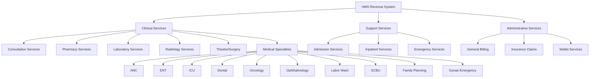
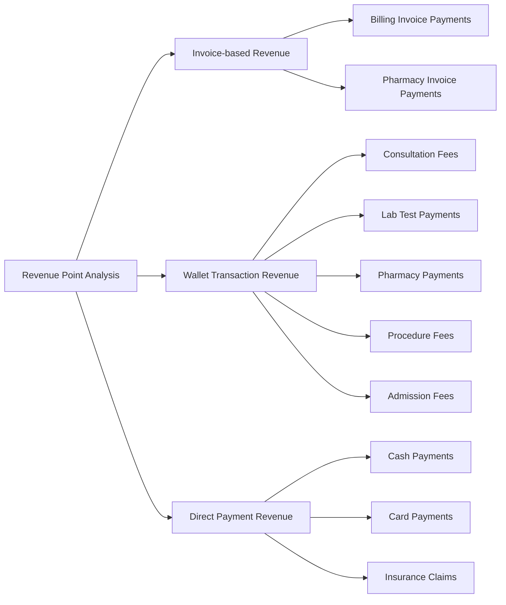

# Revenue Point Breakdown Analysis Design

## Overview

This design document outlines the implementation of a comprehensive revenue point breakdown analysis system for the Hospital Management System (HMS). The feature will provide detailed revenue insights from each department/point of service while maintaining existing revenue tracking logic and extending it to cover all revenue-generating departments.

## Current System Analysis

### Existing Revenue Infrastructure
The HMS currently has established revenue tracking through:
- **Billing System**: Core invoice and payment processing
- **Wallet System**: Patient wallet transactions with categorized transaction types
- **Department-specific Billing**: Pharmacy, Laboratory, Radiology, and clinical departments
- **Service Categories**: Structured service classification with pricing

### Revenue Points Identified


## Architecture Design

### Revenue Point Classification

#### Primary Revenue Sources
| Department | Revenue Models | Transaction Types |
|------------|----------------|-------------------|
| **Pharmacy** | `pharmacy_billing.Payment`, `DispensingLog` | `pharmacy_payment` |
| **Laboratory** | `billing.Invoice` (source_app='laboratory') | `lab_test_payment` |
| **Consultation** | `billing.Invoice` (source_app='appointment') | `consultation_fee` |
| **Theatre** | `billing.Invoice` (theatre procedures) | `procedure_fee` |
| **Radiology** | `billing.Invoice` (radiology orders) | `procedure_fee` |
| **Admission** | `billing.Invoice` (source_app='inpatient') | `admission_fee`, `daily_admission_charge` |

#### Specialty Department Revenue
| Specialty | Models | Service Categories |
|-----------|--------|-------------------|
| **ANC** | `anc.AncRecord` linked invoices | Antenatal care services |
| **ENT** | `ent.EntRecord` linked invoices | ENT procedures |
| **ICU** | `icu.IcuRecord` linked invoices | Intensive care services |
| **Dental** | `dental.DentalRecord` linked invoices | Dental procedures |
| **Oncology** | `oncology.OncologyRecord` linked invoices | Cancer treatment services |
| **Ophthalmology** | `ophthalmic.OphthalmicRecord` linked invoices | Eye care services |
| **Labor Ward** | `labor.LaborRecord` linked invoices | Delivery services |
| **SCBU** | `scbu.ScbuRecord` linked invoices | Special care baby unit |
| **Family Planning** | `family_planning.FamilyPlanningRecord` linked invoices | Family planning services |
| **Gynae Emergency** | `gynae_emergency.GynaeEmergencyRecord` linked invoices | Emergency gynecological services |

### Data Aggregation Strategy

#### Revenue Calculation Logic


#### Revenue Aggregation Service Design
```
RevenuePointAnalyzer:
├── Primary Methods:
│   ├── get_pharmacy_revenue()
│   ├── get_laboratory_revenue()
│   ├── get_consultation_revenue()
│   ├── get_radiology_revenue()
│   ├── get_theatre_revenue()
│   ├── get_admission_revenue()
│   └── get_specialty_revenue(department)
├── Aggregation Methods:
│   ├── get_total_revenue_by_point()
│   ├── get_revenue_trends_by_point()
│   ├── get_revenue_distribution()
│   └── get_comparative_analysis()
└── Filtering Methods:
    ├── filter_by_date_range()
    ├── filter_by_payment_method()
    ├── filter_by_patient_type()
    └── filter_by_service_category()
```

### Data Model Integration

#### Revenue Sources Mapping
```
Revenue Data Sources:
1. Invoice-based Revenue:
   - billing.Invoice + billing.Payment
   - Filter by source_app for department identification
   - Aggregate payment amounts by department

2. Wallet Transaction Revenue:
   - patients.WalletTransaction
   - Filter by transaction_type for service identification
   - Payment-related types: payment, lab_test_payment, pharmacy_payment, 
     consultation_fee, procedure_fee, admission_fee, daily_admission_charge

3. Direct Revenue Tracking:
   - Service-specific models with pricing
   - Department-specific billing records
   - Dispensing logs for pharmacy
```

#### Revenue Point Identification Logic
```
Point Identification Strategy:
├── Invoice Source App Mapping
│   ├── 'laboratory' → Laboratory Revenue
│   ├── 'pharmacy' → Pharmacy Revenue
│   ├── 'appointment' → Consultation Revenue
│   ├── 'radiology' → Radiology Revenue
│   └── 'billing' → General Services Revenue
├── Wallet Transaction Type Mapping
│   ├── 'consultation_fee' → Consultation Revenue
│   ├── 'lab_test_payment' → Laboratory Revenue
│   ├── 'pharmacy_payment' → Pharmacy Revenue
│   ├── 'procedure_fee' → Theatre/Procedure Revenue
│   ├── 'admission_fee' → Admission Revenue
│   └── 'daily_admission_charge' → Inpatient Revenue
└── Service Category Mapping
    ├── Service.category → Department mapping
    └── ServiceCategory → Revenue point association
```

## Feature Components

### Revenue Point Dashboard

#### Main Dashboard Layout
```
Revenue Point Breakdown Dashboard:
├── Header Section
│   ├── Total Revenue Summary
│   ├── Date Range Filter
│   └── Export Options
├── Revenue Point Cards
│   ├── Pharmacy Revenue Card
│   ├── Laboratory Revenue Card
│   ├── Consultation Revenue Card
│   ├── Theatre Revenue Card
│   ├── Radiology Revenue Card
│   ├── Admission Revenue Card
│   └── Specialty Departments Card
├── Visual Analytics
│   ├── Revenue Distribution Pie Chart
│   ├── Monthly Trends Line Chart
│   ├── Department Comparison Bar Chart
│   └── Growth Rate Indicators
└── Detailed Tables
    ├── Revenue Point Summary Table
    ├── Top Services by Revenue Table
    ├── Monthly Breakdown Table
    └── Transaction Detail Table
```

#### Filter and Analysis Options
```
Filter Panel:
├── Date Filters
│   ├── Current Month
│   ├── Previous Month
│   ├── Last 3/6/12 Months
│   ├── Year-to-Date
│   ├── Specific Month Selection
│   └── Custom Date Range
├── Department Filters
│   ├── Select All/None
│   ├── Clinical Services
│   ├── Support Services
│   └── Individual Departments
├── Payment Method Filters
│   ├── Cash Payments
│   ├── Card Payments
│   ├── Wallet Payments
│   ├── Insurance Claims
│   └── Mixed Payments
└── Analysis Options
    ├── Include/Exclude Refunds
    ├── Group by Service Category
    ├── Show Percentage Distribution
    └── Compare with Previous Period
```

### Revenue Calculation Engine

#### Core Calculation Methods
```
Revenue Calculation Logic:

1. Pharmacy Revenue Calculation:
   - Pharmacy billing payments
   - Dispensing log totals
   - Wallet pharmacy payments
   - Cash/card pharmacy transactions

2. Laboratory Revenue Calculation:
   - Laboratory invoice payments
   - Wallet lab test payments
   - Direct test payments
   - Insurance lab claims

3. Consultation Revenue Calculation:
   - Appointment invoice payments
   - Wallet consultation fees
   - Direct consultation payments
   - Doctor consultation fees

4. Theatre Revenue Calculation:
   - Surgery procedure payments
   - Theatre service invoices
   - Procedure fee wallet transactions
   - Surgical equipment charges

5. Specialty Department Revenue:
   - Department-specific service payments
   - Specialized procedure fees
   - Department invoice aggregation
   - Service category revenue mapping
```

#### Revenue Aggregation Formulas
```
Revenue Formulas:

Total Department Revenue = Invoice Payments + Wallet Transactions + Direct Payments

Where:
- Invoice Payments = Σ(billing.Payment.amount WHERE invoice.source_app = department)
- Wallet Transactions = Σ(WalletTransaction.amount WHERE transaction_type = department_type)
- Direct Payments = Σ(Department-specific payment records)

Revenue Percentage = (Department Revenue / Total Revenue) × 100

Growth Rate = ((Current Period Revenue - Previous Period Revenue) / Previous Period Revenue) × 100

Average Transaction Value = Total Revenue / Total Transaction Count
```

### Data Export and Reporting

#### Export Capabilities
```
Export Options:
├── CSV Export
│   ├── Revenue summary by point
│   ├── Monthly trend data
│   ├── Daily breakdown data
│   └── Transaction detail data
├── PDF Reports
│   ├── Executive summary report
│   ├── Department performance report
│   ├── Comparative analysis report
│   └── Monthly/quarterly reports
└── Excel Export
    ├── Multi-sheet workbook
    ├── Charts and graphs included
    ├── Pivot table data
    └── Formatted financial reports
```

#### Report Templates
```
Report Templates:
├── Executive Revenue Summary
│   ├── Key performance indicators
│   ├── Revenue distribution charts
│   ├── Growth trends
│   └── Top performing departments
├── Department Performance Report
│   ├── Individual department analysis
│   ├── Service-wise revenue breakdown
│   ├── Payment method distribution
│   └── Monthly comparison
├── Financial Analysis Report
│   ├── Revenue vs. target analysis
│   ├── Profitability assessment
│   ├── Cost-revenue ratio
│   └── Financial recommendations
└── Operational Insights Report
    ├── Patient volume vs. revenue
    ├── Service utilization rates
    ├── Peak revenue periods
    └── Optimization opportunities
```

## Implementation Considerations

### Performance Optimization
```
Optimization Strategies:
├── Database Indexing
│   ├── Index on payment_date fields
│   ├── Index on source_app fields
│   ├── Index on transaction_type fields
│   └── Composite indexes for common queries
├── Query Optimization
│   ├── Use database aggregation functions
│   ├── Minimize N+1 query problems
│   ├── Use select_related/prefetch_related
│   └── Implement query result caching
├── Data Caching
│   ├── Cache frequently accessed revenue data
│   ├── Redis for session-based filters
│   ├── Memcached for aggregated results
│   └── Database query result caching
└── Pagination and Limits
    ├── Paginate large result sets
    ├── Limit initial data load
    ├── Lazy loading for detailed views
    └── Progressive data loading
```

### Security and Access Control
```
Security Measures:
├── Role-based Access
│   ├── Admin: Full revenue access
│   ├── Accountant: Financial reports access
│   ├── Department Head: Department-specific data
│   └── Doctor: Limited consultation revenue
├── Data Privacy
│   ├── Patient information anonymization
│   ├── HIPAA compliance measures
│   ├── Audit trail for data access
│   └── Secure data transmission
└── Permission Controls
    ├── View permissions by department
    ├── Export permissions control
    ├── Data modification restrictions
    └── Sensitive data masking
```

### Integration with Existing Systems
```
System Integration:
├── Backward Compatibility
│   ├── Maintain existing revenue logic
│   ├── Preserve current report formats
│   ├── Support legacy data access
│   └── Gradual feature rollout
├── API Integration
│   ├── RESTful API for revenue data
│   ├── JSON response formats
│   ├── API versioning support
│   └── Third-party integration capability
├── Reporting Integration
│   ├── Integration with existing reports
│   ├── Dashboard widget compatibility
│   ├── Email report automation
│   └── Scheduled report generation
└── Database Compatibility
    ├── Work with existing models
    ├── Maintain data relationships
    ├── Support migration scripts
    └── Preserve data integrity
```