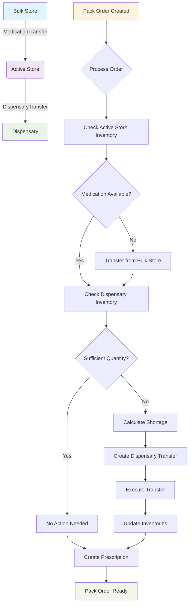

# Medication Transfer Process Diagram

## Process Flow Explanation

1. **Bulk Store to Active Store**:
   - Medications are initially stored in the Bulk Store
   - Transferred to Active Store as needed via MedicationTransfer

2. **Active Store to Dispensary**:
   - Medications in Active Store are transferred to Dispensary via DispensaryTransfer
   - This happens automatically when processing Pack Orders

3. **Pack Order Processing**:
   - When a Pack Order is created, it triggers the transfer process
   - System checks inventory levels at each stage
   - Automatically creates transfers when needed
   - Updates all inventory records after successful transfers

## Key Components

- **MedicationTransfer**: Moves medications from Bulk Store to Active Store
- **DispensaryTransfer**: Moves medications from Active Store to Dispensary
- **Inventory Models**: Track medication quantities at each location
- **PackOrder.process_order()**: Orchestrates the entire transfer process